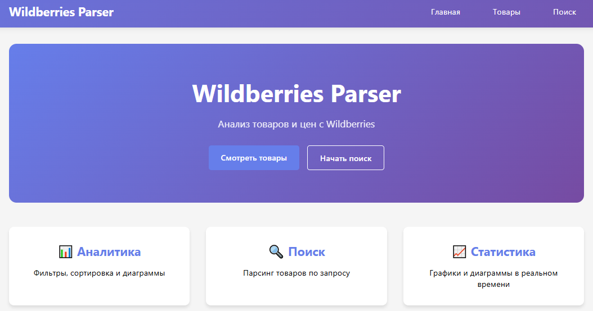
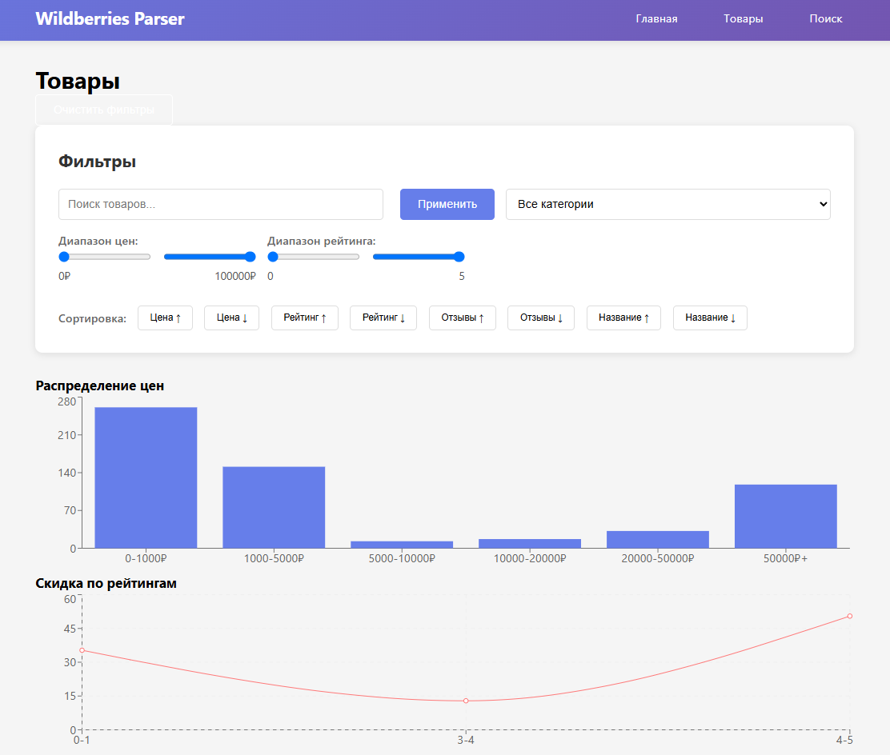

# Wildberries Parser

## Описание

Проект для парсинга товаров с Wildberries и отображения их на современном веб-интерфейсе. Бэкенд реализован на Django, фронтенд — на React.

---

## Backend (Django)
- Парсинг товаров с Wildberries
- Фильтрация, поиск, API для фронта
- Хранение данных в базе

### Запуск backend:
```bash
cd project
python manage.py migrate
python manage.py runserver
```

---

## Frontend (React)

Фронтенд реализован на **React** (находится в папке `frontend/`).

### Основные возможности:
- Просмотр списка товаров
- Детальная страница товара
- Фильтрация и поиск по товарам
- Графики и динамическое обновление данных
- Современный UI/UX

### Структура:
- `frontend/src/components/` — основные компоненты (ProductList, ProductDetail, SearchForm и др.)
- `frontend/public/` — статические файлы и шаблоны

### Запуск фронтенда:
```bash
cd frontend
npm install
npm start
```

Фронтенд будет доступен по адресу [http://localhost:3000](http://localhost:3000)

---

## Особенности

- ⚡ **Быстрый парсинг** через XHR запросы (без браузера)
- 🎯 **Точные данные** - название, цена, скидка, рейтинг, отзывы
- 📂 **Категоризация** - пользователь может указать категорию товаров
- 💾 **PostgreSQL** - надежное хранение данных
- 🌐 **Веб-интерфейс** для просмотра результатов
- 🔧 **Django команды** для удобного запуска
- 🛡️ **Обработка ошибок** и повторные попытки
- 📊 **Статистика и аналитика** - графики и метрики
- 🔍 **Продвинутая фильтрация** - по цене, рейтингу, отзывам
- 📝 **Система логирования** - детальные логи в файлы
- 🚫 **Защита от дубликатов** - автоматическое предотвращение повторных записей

## Установка

1. **Клонируйте репозиторий:**
```bash
git clone <repository-url>
cd Wildberries_parser
```

2. **Создайте виртуальное окружение:**
```bash
python -m venv venv
source venv/bin/activate  # Linux/Mac
# или
venv\Scripts\activate     # Windows
```

3. **Установите зависимости:**
```bash
pip install -r requirements.txt
```

4. **Настройте базу данных PostgreSQL:**
```bash
# Создайте базу данных
createdb wildberries_parser

# Или используйте SQLite для разработки (измените settings.py)
```

5. **Выполните миграции:**
```bash
cd project
python manage.py migrate
```

6. **Создайте суперпользователя (опционально):**
```bash
python manage.py createsuperuser
```

## Использование

### Веб-интерфейс (Рекомендуется)

1. **Запустите сервер:**
```bash
python manage.py runserver
```

2. **Откройте браузер:**
```
http://127.0.0.1:8000/
```

3. **Функции веб-интерфейса:**
- 🏠 **Главная страница** - общая статистика и последние товары
- 🔍 **Поиск товаров** - удобная форма с предустановленными запросами
- 📋 **Список товаров** - с продвинутой фильтрацией и сортировкой
- 📊 **Статистика** - аналитика и графики
- 👁️ **Детальный просмотр** - полная информация о товаре

### 🔍 Поиск и парсинг
- **Быстрые кнопки** - iPhone, ноутбук, кроссовки, платье, телевизор, наушники, книги, игрушки
- **Настройка лимита** - 5, 10, 20, 50 товаров
- **Категоризация** - возможность указать категорию товаров
- **Прогресс-бар** - визуальное отображение процесса парсинга

### 📋 Список товаров
- **Фильтрация по цене** - слайдер с диапазоном цен
- **Фильтрация по рейтингу** - от 0 до 5 звезд
- **Фильтрация по отзывам** - количество отзывов
- **Поиск по названию** - текстовый поиск
- **Фильтр по категории** - выпадающий список категорий
- **Сортировка** - по названию, цене, рейтингу, отзывам, дате
- **Пагинация** - 20 товаров на страницу

### 📊 Статистика
- **Общая статистика** - количество товаров, категорий, запросов
- **Анализ цен** - средняя, минимальная, максимальная цена
- **Топ категорий** - самые популярные категории
- **Топ запросов** - самые частые поисковые запросы
- **Товары со скидкой** - количество товаров со скидками

### 👁️ Детальный просмотр
- **Полная информация** - все данные о товаре
- **Похожие товары** - товары из той же категории
- **Ссылка на Wildberries** - переход на оригинальную страницу

### Веб-интерфейс
- `GET /` - главная страница
- `GET /search/` - форма поиска
- `GET /products/` - список товаров с фильтрацией
- `GET /product/<id>/` - детальная информация о товаре
- `GET /statistics/` - статистика и аналитика

### API для парсинга
- `POST /api/start-parsing/` - запуск парсинга
- `GET /api/price_histogram/` - данные для гистограммы цен
- `GET /api/discount_vs_rating/` - данные для графика скидки vs рейтинг

## Требования

- Python 3.8+
- Django 4.0+
- PostgreSQL (рекомендуется) или SQLite
- requests
- fake-useragent

- beautifulsoup4

